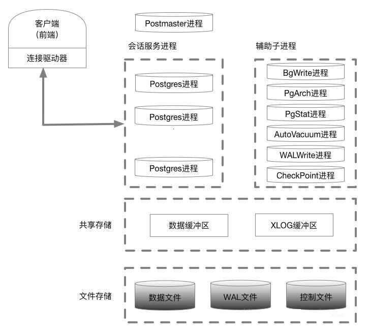

* content
{:toc}

Postgresql 12 体系结构 Study 001 Tips


13th February 2020: PostgreSQL 12.2

[PostgreSQL 12.2 Documentation](https://www.postgresql.org/docs/12/index.html)

[How To Install PostgreSQL 12 on CentOS 7 / CentOS 8](https://computingforgeeks.com/how-to-install-postgresql-12-on-centos-7/)


### 体系结构



在Linux里进程体现:

```shell
[root@centos7_pg ~]# su - postgres
[postgres@centos7_pg ~]$ pg_ctl start -D /data/pgsql10/pgdata -l /tmp/logfile.log
pg_ctl: another server might be running; trying to start server anyway
waiting for server to start..... done
server started
[postgres@centos7_pg ~]$ ps -lax | head -1; ps -lax | grep postgres | grep -v grep
F   UID   PID  PPID PRI  NI    VSZ   RSS WCHAN  STAT TTY        TIME COMMAND
0  1000  1666     1  20   0 376508 16532 poll_s S    pts/0      0:00 /data/pgsql10/bin/postgres -D /data/pgsql10/pgdata
1  1000  1668  1666  20   0 376508  3596 ep_pol Ss   ?          0:00 postgres: checkpointer process
1  1000  1669  1666  20   0 376508  3344 ep_pol Ss   ?          0:00 postgres: writer process
1  1000  1670  1666  20   0 376508  6240 ep_pol Ss   ?          0:00 postgres: wal writer process
1  1000  1671  1666  20   0 376916  2932 ep_pol Ss   ?          0:00 postgres: autovacuum launcher process
1  1000  1672  1666  20   0 231432  1960 ep_pol Ss   ?          0:00 postgres: stats collector process
1  1000  1673  1666  20   0 376800  2432 ep_pol Ss   ?          0:00 postgres: bgworker: logical replication launcher
4     0  1741  1530  20   0 191784  2340 do_wai S    pts/0      0:00 su - postgres
[postgres@centos7_pg ~]$ pstree -p 1666
postgres(1666)─┬─postgres(1668)
               ├─postgres(1669)
               ├─postgres(1670)
               ├─postgres(1671)
               ├─postgres(1672)
               └─postgres(1673)
[postgres@centos7_pg ~]$

```

postgres 父进程创建了6大子进程

```shell

本地连接：

[postgres@centos7_pg ~]$ psql -U postgres -d postgres -h 10.0.3.15 -p 5432
Password for user postgres:
You are connected to database "postgres" as user "postgres" on host "10.0.3.15" at port "5432".
psql (10.11)
Type "help" for help.

postgres@postgres=>

启动另外一个终端：

[postgres@centos7_pg ~]$ ps -lax | head -1; ps -lax | grep postgres | grep -v grep
F   UID   PID  PPID PRI  NI    VSZ   RSS WCHAN  STAT TTY        TIME COMMAND
0  1000  1666     1  20   0 376508 16588 poll_s S    pts/0      0:00 /data/pgsql10/bin/postgres -D /data/pgsql10/pgdata
1  1000  1668  1666  20   0 376508  3596 ep_pol Ss   ?          0:00 postgres: checkpointer process
1  1000  1669  1666  20   0 376508  3344 ep_pol Ss   ?          0:00 postgres: writer process
1  1000  1670  1666  20   0 376508  6240 ep_pol Ss   ?          0:00 postgres: wal writer process
1  1000  1671  1666  20   0 376916  2984 ep_pol Ss   ?          0:00 postgres: autovacuum launcher process
1  1000  1672  1666  20   0 231432  2048 ep_pol Ss   ?          0:00 postgres: stats collector process
1  1000  1673  1666  20   0 376800  2432 ep_pol Ss   ?          0:00 postgres: bgworker: logical replication launcher
4     0  1741  1530  20   0 191784  2340 do_wai S    pts/0      0:00 su - postgres
0  1000  1786  1742  20   0 184408  3784 n_tty_ S+   pts/0      0:00 psql -U postgres -d postgres -h 10.0.3.15 -p 5432
1  1000  1788  1666  20   0 377432  5104 ep_pol Ss   ?          0:00 postgres: postgres postgres 10.0.3.15(42890) idle
4     0  1801  1556  20   0 191784  2336 do_wai S    pts/1      0:00 su - postgres
[postgres@centos7_pg ~]$ pstree -p 1666
postgres(1666)─┬─postgres(1668)
               ├─postgres(1669)
               ├─postgres(1670)
               ├─postgres(1671)
               ├─postgres(1672)
               ├─postgres(1673)
               └─postgres(1788)
[postgres@centos7_pg ~]$

```

连接示例:

```
[postgres@centos7_pg ~]$ psql -U postgres -d postgres -h 10.0.3.15 -p 5432
Password for user postgres:
You are connected to database "postgres" as user "postgres" on host "10.0.3.15" at port "5432".
psql (10.11)
Type "help" for help.

postgres@postgres=>
```

#### pstree 安装 Tips

1.在 Mac OS上

      brew install pstree

2.在 Fedora/Red Hat/CentOS

      yum -y install psmisc

3.在 Ubuntu/Debian

     apt-get install psmisc


#### 多台虚拟机问题


ip/mac 地址冲突，通过删除下面文件重新启动虚拟机

配置文件：*/etc/udev/rules.d/70-persistent-net.rules*


Have a good work&life! 2020/09 via LinHong


